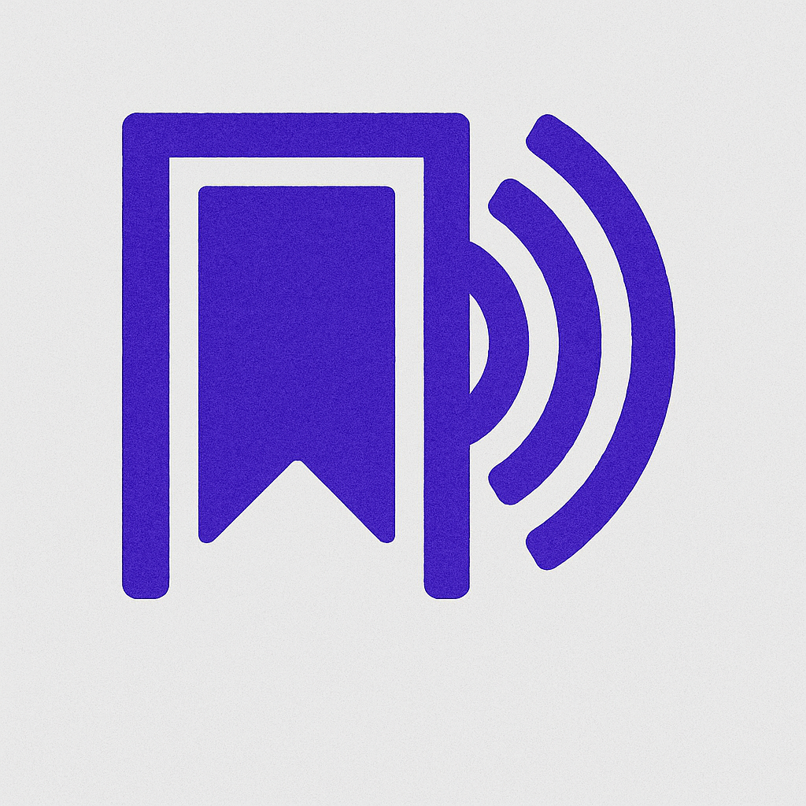

# Castmark - Bookmark & Share Farcaster Casts on Base

<p align="center">
  
</p>

## 🏆 Base Batches North America Hackathon Entry

Castmark is a web3-native bookmark manager that lets you save, organize, and share your favorite Farcaster casts. It combines the social power of Farcaster with the permanence of Base blockchain to create a seamless experience for curation and sharing.

### 🔥 Key Features

- **Save & Organize**: Bookmark any Farcaster cast with just the URL or hash
- **Collections**: Group related casts into themed collections with custom descriptions
- **On-chain Registration**: Register your collections on Base for permanent attribution
- **Interactive Frames**: Share collections via Farcaster Frames for seamless discovery
- **Wallet Integration**: Connect your wallet to claim on-chain ownership of your collections

## 💡 Why Castmark?

The Farcaster ecosystem is growing rapidly, with valuable content being created daily. Castmark solves the problem of content curation and discovery by enabling users to:

1. **Preserve valuable content** they discover on Farcaster
2. **Organize knowledge** into meaningful collections
3. **Establish ownership** of their curation work on-chain
4. **Share seamlessly** back to the Farcaster ecosystem via Frames

## 🔗 Base Integration

Castmark leverages Base blockchain to provide:

- **Verifiable Ownership**: Collections registered on Base establish clear provenance
- **Permanent Attribution**: Your curation work is permanently linked to your wallet
- **Interoperability**: On-chain collections can be referenced by other applications
- **Future Token Gating**: Potential for exclusive access to premium collections

## 🖼️ Farcaster Frames Integration

Castmark's Frame implementation allows:

- **One-click Sharing**: Share collections directly to Farcaster
- **Interactive Frames**: Users can view and interact with collections without leaving Warpcast
- **Direct Registration**: Register collections on Base directly through Frame actions
- **Seamless Discovery**: Help others discover valuable content you've curated

## 🛠️ Technologies Used

- **Frontend**: Next.js, TailwindCSS, Framer Motion
- **Backend**: Supabase, Next.js API Routes
- **Blockchain**: Base blockchain, Wagmi, Viem, OnchainKit MiniKit
- **Social**: Farcaster Frames, Neynar API
- **Auth**: Farcaster authentication via MiniKit

## 🚀 Getting Started

### Environment Setup

Create a `.env.local` file with:

```
# Supabase
NEXT_PUBLIC_SUPABASE_URL=your_supabase_url
NEXT_PUBLIC_SUPABASE_ANON_KEY=your_supabase_anon_key

# Smart Contract (after deployment)
NEXT_PUBLIC_CONTRACT_ADDRESS=your_contract_address_on_base

# App URL
NEXT_PUBLIC_URL=https://your-deployment-url.com

# OnchainKit
NEXT_PUBLIC_ONCHAINKIT_API_KEY=your_onchainkit_api_key
```

### Database Migration

Ensure your Supabase `collections` table has:

- `is_registered` (boolean, default: false)
- `transaction_hash` (text, nullable)

### Development

```bash
# Install dependencies
npm install

# Run development server
npm run dev
```

## 🧠 How It Works

### Saving Casts

1. Paste a Farcaster cast URL or hash
2. Add optional tags and notes
3. Save to your personal bookmarks

### Creating Collections

1. Create a collection with a name and description
2. Add bookmarks to your collection
3. Register the collection on Base for permanence

### Sharing with Frames

1. Click "Share" on any collection
2. A Frame is created that others can interact with
3. Users can view your collection or register it themselves

## 🌱 Future Plans

- **Mobile App**: Native mobile experience with push notifications
- **Token Gating**: Premium collections accessible via token ownership
- **AI Summarization**: Automatically generate collection descriptions
- **Analytics**: Track views and interactions with your collections
- **Recommendation Engine**: Discover collections based on interests

## 🧑‍💻 Team

Built with ❤️ for the Base Batches North America Hackathon
